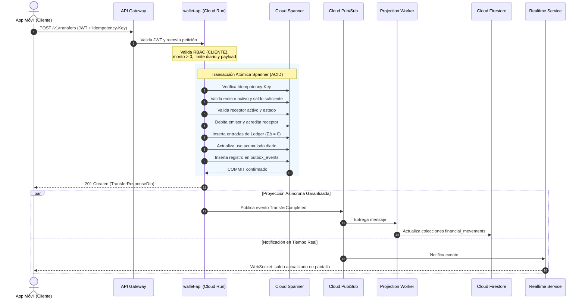

# Arquitectura del Sistema Financiero NequiTrampa
## Proyecto Financiero Móvil sobre Google Cloud Platform (GCP)
### Justificación Técnica y Análisis Arquitectónico Profundo

---

## 1. Resumen Ejecutivo y Visión Arquitectónica

**NequiTrampa** es una plataforma financiera digital de dinero simulado (moneda única: **COP**), diseñada con estándares de grado bancario y principios de **Clean Architecture**, **Domain-Driven Design (DDD)** y **Zero Trust Security**.

El reto central de un sistema financiero no es la complejidad visual, sino la **garantía de consistencia matemática y trazabilidad contable inmutable frente a fallos de red, concurrencia masiva y particiones de infraestructura**. 

Para resolver esto sin caer en compromisos de rendimiento ni comprometer la integridad del dinero, la arquitectura divide explícitamente el sistema en tres planos de persistencia con responsabilidades no negociables:

```
+-----------------------------------------------------------------------------------+
|                              DISPOSITIVO MÓVIL                                    |
|                      React Native + Expo (TypeScript)                             |
|                                                                                   |
|  [ SQLite ]: Caché local (último saldo sincronizado, movimientos) + Cola Offline  |
+------------------------------------------+----------------------------------------+
                                           | HTTPS / TLS 1.3
                                           v
+-----------------------------------------------------------------------------------+
|                             IDENTITY & API GATEWAY                                |
|  - Cloud Identity Platform: Autenticación federada, TOTP MFA, emisión JWT (RFC 8725)|
|  - API Gateway: Inspección perimetral, validación criptográfica y rate limiting   |
+------------------------------------------+----------------------------------------+
                                           | JWT Claims + Trace Context
                                           v
+-----------------------------------------------------------------------------------+
|                        CAPA DE SERVICIOS (Cloud Run)                              |
|                   ASP.NET Core (.NET 10) / C# (Serverless)                        |
|                                                                                   |
|   +---------------+  +---------------+  +------------------+  +---------------+   |
|   |   core-api    |  |  wallet-api   |  |  backoffice-api  |  | assistant-api |   |
|   +-------+-------+  +-------+-------+  +--------+---------+  +-------+-------+   |
+-----------|------------------|-------------------|--------------------|-----------+
            |                  |                   |                    |
            |                  | ACID Writes       | Admin Ops          | Read-Only
            |                  v                   v                    |
            |       +------------------------------------+              |
            |       |     GOOGLE CLOUD SPANNER           |              |
            |       |  * Verdad Financiera Autoritativa  |              |
            |       |  * Ledger doble partida (ΣΔ = 0)   |              |
            |       |  * Saldos oficiales inmutables     |              |
            |       |  * Transactional Outbox            |              |
            |       +-----------------+------------------+              |
            |                         |                                 |
            |                         v CDC / Outbox Worker             |
            |               +--------------------+                      |
            |               |  Google Pub/Sub    |                      |
            |               +---------+----------+                      |
            |                         |                                 |
            |     +-------------------+-------------------+             |
            |     v                                       v             |
            |  +--------------------+             +------------------+  |
            |  | Projection Worker  |             | Realtime Service |  |
            |  +----------+---------+             |   (WebSockets)   |  |
            |             |                       +--------+---------+  |
            v             v Read-Optimized Projections     |            |
+------------------------------------+                     |            |
|       GOOGLE CLOUD FIRESTORE       |                     |            |
|  * Movimientos visibles de usuario |                     |            |
|  * Categorías, presupuestos, metas |                     |            |
|  * Registro de efectivo y soporte  |<--------------------+------------+
+------------------------------------+
```

---

## 2. Justificación Profunda: Cloud Spanner vs. Cloud Firestore

Una de las decisiones arquitectónicas fundamentales es el desacoplamiento estricto entre la **autoridad financiera** y las **proyecciones de lectura / datos dinámicos**.

### 2.1 Cloud Spanner: Autoridad Financiera Absoluta (La Verdad Contable)

#### A. Consistencia Externa y Serializabilidad Estricta (TrueTime)
Los sistemas financieros no toleran anomalías de concurrencia como *Write Skew*, *Phantom Reads* o transacciones solapadas que puedan duplicar balances o permitir sobregiros concurrentes. 
Cloud Spanner proporciona **Strict Serializability** mediante la API de sincronización temporal asistida por hardware atómico (**TrueTime** de Google). A diferencia de los motores NoSQL o RDBMS convencionales con replicación asíncrona, Spanner garantiza que si una transacción $T_2$ se inicia después de que $T_1$ hace commit en cualquier parte del mundo, el timestamp de commit de $T_2$ será estrictamente mayor que el de $T_1$ ($T_1 \prec T_2$).

#### B. Modelo de Contabilidad por Partida Doble (*Double-Entry Ledger*)
En **NequiTrampa**, el dinero no se "edita", se contabiliza. Cada movimiento financiero genera un registro en `ledger_operations` y al menos dos asientos balanceados en `ledger_entries`:
$$\sum_{i} \Delta_{i} = 0$$
En la misma transacción atómica en Spanner:
1. Se valida que el cliente emisor tenga saldo suficiente: `current_balance - amount >= 0`.
2. Se descuenta el balance del emisor.
3. Se incrementa el balance del receptor.
4. Se insertan las entradas débito/crédito en el ledger.
5. Se verifica el límite diario acumulado ($\le \$5.000.000\text{ COP}$) en `daily_transfer_usage`.
6. Se persiste el registro de **Idempotencia** (`idempotency_records`).
7. Se inserta el evento en la tabla `outbox_events` (**Transactional Outbox Pattern**).

Si alguna restricción falla (por ejemplo, saldo insuficiente o conflicto de idempotencia), la transacción se aborta completamente (**Rollback**), garantizando que jamás existan asientos contables huérfanos.

#### C. Inmutabilidad y Correcciones Compensatorias
De acuerdo con las reglas de negocio congeladas:
* **No existe DELETE financiero**: Está prohibido `DELETE /v1/transfers/{id}` o `PATCH /v1/wallet/{id}/balance`.
* Cualquier corrección de error u omisión se realiza mediante una nueva transacción compensatoria de tipo `REVERSAL` o `ADMIN_ADJUSTMENT`, con referencia estricta a la operación original, actor responsable y auditoría registrada.

---

### 2.2 Cloud Firestore: Proyecciones Dinámicas y Experiencia de Usuario

#### A. Por qué Firestore NO es la autoridad financiera
Firestore es una base de datos NoSQL documental orientada al cliente. Aunque soporta transacciones ACID sobre un conjunto limitado de documentos, su modelo de concurrencia optimista y escalabilidad horizontal de particiones no está diseñado para la contabilidad multicuenta de alta concurrencia ni para invariantes matemáticos globales complejos (como sumatorias contables distribuidas en tiempo real). Permitir que Firestore gestione saldos crearía ventanas de inconsistencia eventual inaceptables para un dominio financiero.

#### B. Por qué Firestore es la solución óptima para el plano de experiencia
1. **Desacoplamiento de Carga**: Spanner tiene un costo computacional y financiero superior por nodo. Si las consultas frecuentes de la app móvil (scroll de movimientos, desglose por categorías, gráficos de presupuesto, metas de ahorro) atacaran directamente a Spanner, saturarían las cuotas transaccionales.
2. **Consultas Flexibles y Proyecciones Denormalizadas**: Firestore almacena documentos listos para ser consumidos por la interfaz (`financial_movements`, `categories`, `budgets`, `goals`, `cash_summaries`).
3. **Escuchadores en Tiempo Real (*Snapshots*)**: Permite sincronizar la interfaz del usuario de forma reactiva cuando el `Projection Worker` actualiza un documento.
4. **Separación del Efectivo (*Cash*)**: El registro de efectivo físico es un dato personal no custodiado por la entidad bancaria; almacenar el efectivo en Firestore garantiza que jamás contamine el balance digital auditado en Spanner.

---

### 2.3 Matriz Comparativa de Persistencia

| Criterio | Cloud Spanner | Cloud Firestore | SQLite (Móvil) |
| :--- | :--- | :--- | :--- |
| **Rol en el Sistema** | Fuente de Verdad Financiera Autoritativa | Experiencia, Proyecciones y Documentos | Caché local y cola offline |
| **Modelo de Datos** | Relacional Distribuido (GoogleSQL) | NoSQL Documental (Colecciones/Documentos) | Relacional Ligero embebido |
| **Garantía Transaccional** | Serializabilidad Estricta (ACID global, TrueTime) | ACID por transacción documental (Optimistic) | Transaccional local a nivel de proceso |
| **Entidades Principales** | `clients`, `wallet_accounts`, `ledger_operations`, `ledger_entries`, `idempotency_records`, `outbox_events` | `financial_movements`, `categories`, `budgets`, `goals`, `support_cases`, `cash_movements` | Caché de movimientos, último saldo conocido, cola `cash_sync_queue` |
| **Invariante Crítico** | `current_balance >= 0` y $\sum \Delta = 0$ | Proyección idempotente de eventos | No autoriza transferencias ni recargas |
| **Resolución de Conflictos** | Prevalece ante cualquier contradicción | Se reconstruye desde el Outbox de Spanner | Sobrescrito por datos sincronizados del servidor |

---

## 3. Justificación de Cómputo: Cloud Run (Serverless Container Platform)

Para la ejecución del backend desarrollado en **ASP.NET Core (.NET 10) / C#**, se seleccionó **Google Cloud Run** frente a Google Kubernetes Engine (GKE), Compute Engine (VMs) y Cloud Functions.

### 3.1 Ventajas Técnicas para el Proyecto
1. **Container-Native (Docker/OCI)**: Permite compilar y empaquetar aplicaciones C# 8 altamente optimizadas (`dotnet 8.0-chiseled` para mínima superficie de ataque), con arranque ultrarrápido y portabilidad total entre desarrollo local y nube.
2. **Aislamiento por Dominio de Servicio**: Permite agrupar los microservicios recomendados (`wallet-api`, `core-api`, `backoffice-api`, `assistant-api`, `workers`) en contenedores independientes, aislando la asignación de memoria, CPU y permisos IAM por servicio.
3. **Escalado a Cero y Costo Académico**: Durante periodos de inactividad, los contenedores reducen su consumo a 0 instancias, encajando dentro del nivel gratuito de GCP (2 millones de peticiones/mes gratis) sin incurrir en costos fijos de clústeres como GKE.
4. **Soporte Nativo de WebSockets y HTTP/2**: Imprescindible para el servicio `realtime-service`, manteniendo conexiones persistentes dúplex hacia la app móvil con terminación TLS automática.
5. **Seguridad Nativa con Secret Manager y Workload Identity**: Cada contenedor de Cloud Run ejecuta bajo una **Service Account** dedicada con permisos de mínimo privilegio (ej: `wallet-api-sa` tiene rol de lectura/escritura en Spanner y publicación en Pub/Sub; `assistant-api-sa` solo tiene permisos de lectura y llamada a Vertex AI).

---

## 4. Estándares de Seguridad y Protocolos de Comunicación

### 4.1 Autenticación e Identidad: Cloud Identity Platform + JWT (RFC 8725)
* La autenticación reside en **Google Cloud Identity Platform**. El backend de ASP.NET Core no almacena contraseñas ni hashes salados; únicamente valida los tokens JWT de acceso.
* **Cumplimiento estricto con RFC 8725 (JWT Best Current Practices)**:
  * **Verificación de Emisor (`iss`)**: Debe coincidir exactamente con `https://securetoken.google.com/{PROJECT_ID}`.
  * **Verificación de Audiencia (`aud`)**: Debe coincidir con el ID del proyecto GCP.
  * **Algoritmo Explícito**: Únicamente se acepta `RS256` proveniente del JWKS oficial de Google; se rechaza categóricamente el algoritmo `none` o algoritmos simétricos no autorizados.
  * **Validación Temporal**: Verificación rigurosa de expiración (`exp`) y tiempo de validez (`nbf`) con tolerancia máxima (*clock skew*) de 1 minuto.

### 4.2 Autorización y Modelo de Roles (RBAC + Resource-Based Authorization)
El sistema implementa el principio de **Mínimo Privilegio** y una política global **Deny-by-Default**:
* Cualquier ruta no decorada con directivas explícitas es rechazada por defecto.
* **Separación de Responsabilidades por Rol**:
  * `CLIENTE`: Acceso restringido a sus propios recursos (`userId == route.ownerId`).
  * `SOPORTE`: Acceso de lectura a casos, transacciones y timeline para diagnóstico. **Prohibido terminantemente ejecutar movimientos de dinero o reversos**.
  * `OPERADOR_FINANCIERO`: Puede auditar ledger y ejecutar compensaciones formales (`REVERSAL`, `ADMIN_ADJUSTMENT`). **No administra roles ni modifica balances directamente**.
  * `ADMIN`: Administra usuarios, activaciones y roles. **No puede modificar saldos ni editar el ledger contable**.
  * `IA / Asistente`: Exclusivamente de consulta (solo endpoints GET e interfaces informativas). Bloqueado a nivel IAM y de contrato para evitar cualquier mutación financiera.

### 4.3 Manejo Estandarizado de Errores: RFC 9457 (Problem Details)
Para garantizar la interoperabilidad con clientes móviles y herramientas de prueba automatizada (Postman / Bruno), todos los errores se emiten bajo la especificación **RFC 9457**:
* Encabezado de respuesta: `Content-Type: application/problem+json`.
* Campos canónicos obligatorios: `type`, `title`, `status`, `detail`, `instance`.
* Extensiones seguras: `traceId` y `code` de negocio (ej: `INSUFFICIENT_FUNDS`, `IDEMPOTENCY_CONFLICT`).
* **Protección contra fuga de información (OWASP Top 10)**: Bajo ninguna circunstancia se retornan excepciones no controladas, cadenas de conexión, trazas de pila (stack traces) o sintaxis SQL al cliente.

---

## 5. El Flujo Transaccional de una Transferencia

A continuación se resume la secuencia crítica que asegura consistencia absoluta y entrega de eventos:



---

## 6. Conclusión de Principios Fundamentales

La arquitectura de **NequiTrampa** combina lo mejor de dos mundos: la **seguridad inquebrantable de Cloud Spanner** para proteger la integridad contable del dinero y la **agilidad de Cloud Firestore y Cloud Run** para entregar una experiencia móvil moderna, reactiva y costo-eficiente. Cada tecnología tiene un propósito definido, medible y protegido por barreras criptográficas y de red.

---

## 7. Distinción Fundamental: Dominio Funcional vs. Rol vs. Despliegue

Para evitar errores comunes de diseño distribuido (como la sobrefragmentación en decenas de microservicios o el acoplamiento rígido de APIs a roles de usuario), se establecen tres dimensiones ortogonales:

1. **Dominio / Servicio Funcional**: Capacidad del sistema de negocio (ej. *Transfers*, *Cash*, *Support Management*, *Reversals*).
2. **Rol (RBAC)**: Sujeto que ejecuta una acción y sus límites de seguridad (`CLIENTE`, `SOPORTE`, `OPERADOR_FINANCIERO`, `ADMIN`). Un rol nunca equivale a un microservicio.
3. **Unidad Física de Despliegue**: Agrupación lógica de dominios empaquetados en un contenedor Cloud Run (`core-api`, `wallet-api`, `backoffice-api`, `assistant-api`, `workers`).

```
+-------------------------------------------------------------------------------+
|                       DIMENSIÓN 1: ROLES (¿QUIÉN?)                            |
|       [ CLIENTE ]    [ SOPORTE ]    [ OPERADOR_FINANCIERO ]    [ ADMIN ]      |
+-------------------------------------------------------------------------------+
                                        | Aplica Políticas RBAC y Resource Auth
                                        v
+-------------------------------------------------------------------------------+
|                   DIMENSIÓN 2: DOMINIOS FUNCIONALES (¿QUÉ?)                  |
|  Profile/Access · Wallet · Transfers · Recharges · Beneficiaries · Movements  |
|  Cash · Categories · Budgets · Goals · Analytics · Support · Assistant · Voice|
|  Investigation · Financial Ops · Reversals · Adjustments · Reconciliation     |
|  Users · Roles · Configuration · Audit · Notifications · Idempotency · Outbox |
+-------------------------------------------------------------------------------+
                                        | Empaquetado Modular
                                        v
+-------------------------------------------------------------------------------+
|            DIMENSIÓN 3: UNIDADES DE DESPLIEGUE EN CLOUD RUN (¿DÓNDE?)         |
|  * core-api       : Profile, Access, Movements, Cash, Categories, Budgets,    |
|                     Goals, Analytics, Sync                                    |
|  * wallet-api     : Wallet, Transfers, Recharges, Beneficiaries               |
|  * backoffice-api : Support, Investigation, Financial Operations, Reversals,  |
|                     Adjustments, Reconciliation, Users, Roles, Config, Audit  |
|  * assistant-api  : Assistant (IA Consultiva), Voice (Speech-to-Text)         |
|  * workers        : Outbox Worker, Projection Worker, Notification Worker     |
+-------------------------------------------------------------------------------+
```

---

## 8. Catálogo Funcional Corregido y Formalizado

### 8.1 CLIENTE
* **Profile**: Gestión de datos básicos personales y estado.
  * Subdominio **Access**: `/v1/me/access` (capacidad subordinada para informar al cliente sus roles y permisos efectivos para renderizado de UI; no autoriza operaciones en backend).
* **Wallet**: Consulta de billetera y **saldo digital oficial** contra Cloud Spanner.
* **Transfers**: Transferencias internas entre clientes activos. Requiere monto $>0$, límite unitario $\le \$2.000.000\text{ COP}$, límite diario $\le \$5.000.000\text{ COP}$, idempotencia obligatoria, débito/crédito atómico en Spanner y registro en Outbox.
* **Recharges**: Recargas simuladas de saldo digital con `Idempotency-Key` y asiento de crédito en Spanner.
* **Beneficiaries**: Gestión de destinatarios frecuentes (se permite `DELETE` de beneficiario; jamás `DELETE` financiero).
* **Movements**: Consulta optimizada del historial de transacciones proyectadas en Firestore (`financial_movements`).
* **Cash**: Registro de ingresos, gastos y ajustes de efectivo físico y saldo declarado. Persiste en Firestore (y SQLite en offline). Totalmente desacoplado de la billetera digital.
* **Categories**: Catálogo de categorías predefinidas y personalizadas del usuario almacenadas en Firestore.
* **Budgets**: Definición y seguimiento de presupuestos de gasto mensual (Firestore).
* **Goals**: Metas financieras personales y seguimiento de progreso de ahorro (Firestore).
* **Analytics**: Consultas agregadas de solo lectura para dashboards (tendencias, desglose de gastos, flujo de efectivo).
* **Support (Lado Cliente)**: Apertura de casos de consulta/incidencia y envío de mensajes en Firestore.
* **Assistant**: IA consultiva y explicativa financiera. Estrictamente de lectura; bloqueada a nivel prompt, IAM y endpoints para impedir cualquier mutación de saldos o transacciones.
* **Voice**: Transcripción de audio a texto y generación de borradores de movimiento de caja. Exige confirmación explícita del usuario antes de persistir en `Cash`.
* **Sync**: Sincronización de movimientos de efectivo offline desde SQLite hacia el backend. Prohibido autorizar transferencias o recargas offline.

### 8.2 SOPORTE
* **Support Management**: Gestión integral de casos: consulta, actualización de estados, asignación a agentes y **escalación** al operador financiero.
* **Investigation**: Consulta de estado seguro, línea de tiempo (*timeline*) y estado de proyección (Spanner vs. Firestore vs. Realtime) de operaciones reportadas. **Principio inquebrantable**: Soporte investiga incidencias pero no mueve dinero ni crea ajustes.
* **Customer Lookup**: Búsqueda de clientes por teléfono o documento para atención de casos aplicando minimización de datos (sin exponer contraseñas, secretos ni tokens).

### 8.3 OPERADOR_FINANCIERO
* **Financial Operations**: Inspección profunda de operaciones autoritativas, consulta formal del ledger contable e inspección de auditoría financiera en Spanner.
* **Reversals**: Creación de reversos formales (`REVERSAL`) ante fallos operacionales. Crea una nueva transacción en Spanner con referencia a la original; nunca borra ni edita el registro previo.
* **Adjustments**: Generación de ajustes compensatorios manuales debidamente auditados (`ADMIN_ADJUSTMENT`). Prohibido modificar balances mediante `PATCH`.
* **Reconciliation**: Gestión y resolución formal de discrepancias contables (saldo materializado vs. ledger) o de proyección (Spanner vs. Firestore).
* **Escalated Support Cases**: Atención de casos de clientes que requirieron intervención financiera escalada desde Soporte.

### 8.4 ADMIN
* **Users**: Consulta de usuarios de plataforma, activación y bloqueo administrativo.
* **Roles**: Asignación y revocación de roles de usuario con auditoría rigurosa y prevención de autoelevación de privilegios.
* **Configuration**: Parámetros globales de la plataforma (ej. banderas de encendido de IA, umbrales de rate limit). Prohibido alterar saldos o transacciones.
* **Audit**: Consulta y exportación de bitácoras de auditoría de plataforma y seguridad.

### 8.5 TRANSVERSALES (Capacidades Compartidas Multi-Rol)
* **Authentication**: Verificación perimetral y descentralizada de tokens JWT de Google Cloud Identity Platform (RFC 8725).
* **Authorization**: Evaluación RBAC y Resource-Based con política *Deny-by-Default*.
* **Idempotency**: Procesamiento seguro contra duplicidad de peticiones POST mediante `Idempotency-Key` en Spanner.
* **Notifications**: Gestión transversal de avisos a clientes (pagos recibidos, alertas), soporte (casos asignados), operadores (casos escalados) y admins.
* **Problem Details**: Respuestas de error homogéneas según RFC 9457 (`application/problem+json`).
* **Logging & Monitoring**: Trazabilidad con `traceId`, métricas y observabilidad en Cloud Logging.
* **Health**: Verificación de ciclo de vida (`/health/live`, `/health/ready`) para Cloud Run.

### 8.6 INTERNOS / ASÍNCRONOS
* **Transactional Outbox**: Tabla persistente en Spanner dentro de la misma transacción ACID de las operaciones.
* **Outbox Worker**: Proceso lector de eventos confirmados para publicación en Google Cloud Pub/Sub.
* **Pub/Sub**: Bus asíncrono desacoplado con topics y Dead Letter Queues (DLQ).
* **Projection Worker**: Consumidor de eventos que materializa vistas de lectura en Cloud Firestore.
* **Realtime Service**: Difusión de eventos hacia la app móvil mediante WebSockets.
* **Notification Worker**: Envío en background de notificaciones push (FCM) y correos.

---

## 9. Matriz Completa Endpoint → Rol → Policy → Recurso → Persistencia

| Dominio | Endpoint | Verbo HTTP | Rol Requerido | Policy de Autorización | Validación de Recurso (Ownership) | Persistencia | Estado Actual |
| :--- | :--- | :---: | :---: | :--- | :--- | :--- | :---: |
| **Profile** | `/v1/me` | GET | `CLIENTE` | `RequireCliente` | `sub == me` | Spanner | ⚪ DEFINIDO |
| **Profile** | `/v1/me` | PATCH | `CLIENTE` | `RequireCliente` | `sub == me` | Spanner | ⚪ DEFINIDO |
| **Access** | `/v1/me/access` | GET | `CLIENTE` | `RequireCliente` | `sub == me` | Identity Platform / Claims | ⚪ DEFINIDO |
| **Wallet** | `/v1/wallet` | GET | `CLIENTE` | `RequireCliente` | `wallet.clientId == sub` | Spanner | ✅ AS-IS Verificado (GCP / Cloud Spanner) |
| **Wallet** | `/v1/wallet/balance` | GET | `CLIENTE` | `RequireCliente` | `wallet.clientId == sub` | Spanner | ✅ AS-IS Verificado (GCP / Cloud Spanner) |
| **Transfers** | `/v1/transfers` | POST | `CLIENTE` | `CanTransferOrRecharge` | `originClientId == sub` | Spanner (ACID) $\rightarrow$ Outbox | ✅ AS-IS Verificado (GCP / Cloud Spanner) |
| **Transfers** | `/v1/transfers` | GET | `CLIENTE` | `RequireCliente` | `transfer.clientId == sub` | Spanner | ✅ AS-IS Verificado (GCP / Cloud Spanner) |
| **Transfers** | `/v1/transfers/{id}` | GET | `CLIENTE` | `RequireCliente` | `origin == sub \|\| dest == sub` | Spanner | ✅ AS-IS Verificado (GCP / Cloud Spanner) |
| **Transfers** | `/v1/transfers/{id}/receipt` | GET | `CLIENTE` | `RequireCliente` | `origin == sub \|\| dest == sub` | Spanner | ✅ AS-IS Verificado (GCP / Cloud Spanner) |
| **Recharges** | `/v1/recharges` | POST | `CLIENTE` | `CanTransferOrRecharge` | `clientId == sub` | Spanner (ACID) $\rightarrow$ Outbox | ✅ AS-IS Verificado (GCP / Cloud Spanner) |
| **Recharges** | `/v1/recharges` | GET | `CLIENTE` | `RequireCliente` | `clientId == sub` | Spanner | ✅ AS-IS Verificado (GCP / Cloud Spanner) |
| **Beneficiaries** | `/v1/beneficiaries` | GET | `CLIENTE` | `RequireCliente` | `ownerId == sub` | Firestore / Spanner | ⚪ DEFINIDO |
| **Beneficiaries** | `/v1/beneficiaries` | POST | `CLIENTE` | `RequireCliente` | `ownerId == sub` | Firestore / Spanner | ⚪ DEFINIDO |
| **Beneficiaries** | `/v1/beneficiaries/{id}` | DELETE | `CLIENTE` | `RequireCliente` | `ownerId == sub` | Firestore / Spanner | ⚪ DEFINIDO |
| **Movements** | `/v1/movements` | GET | `CLIENTE` | `RequireCliente` | `ownerId == sub` | Firestore (Proyección) | ⚪ DEFINIDO |
| **Movements** | `/v1/movements/{id}` | GET | `CLIENTE` | `RequireCliente` | `ownerId == sub` | Firestore (Proyección) | ⚪ DEFINIDO |
| **Cash** | `/v1/cash/balance` | GET | `CLIENTE` | `RequireCliente` | `ownerId == sub` | Firestore / SQLite | ⚪ DEFINIDO |
| **Cash** | `/v1/cash/movements` | GET | `CLIENTE` | `RequireCliente` | `ownerId == sub` | Firestore / SQLite | ⚪ DEFINIDO |
| **Cash** | `/v1/cash/movements` | POST | `CLIENTE` | `RequireCliente` | `ownerId == sub` | Firestore / SQLite | ⚪ DEFINIDO |
| **Categories** | `/v1/categories` | GET | `CLIENTE` | `RequireCliente` | `isSystem \|\| ownerId == sub`| Firestore (`categories`) | ⚪ DEFINIDO |
| **Categories** | `/v1/categories` | POST | `CLIENTE` | `RequireCliente` | `ownerId == sub` | Firestore (`categories`) | ⚪ DEFINIDO |
| **Budgets** | `/v1/budgets` | GET | `CLIENTE` | `RequireCliente` | `ownerId == sub` | Firestore | ⚪ DEFINIDO |
| **Budgets** | `/v1/budgets` | POST | `CLIENTE` | `RequireCliente` | `ownerId == sub` | Firestore | ⚪ DEFINIDO |
| **Budgets** | `/v1/budgets/{id}` | PATCH | `CLIENTE` | `RequireCliente` | `ownerId == sub` | Firestore | ⚪ DEFINIDO |
| **Goals** | `/v1/goals` | GET | `CLIENTE` | `RequireCliente` | `ownerId == sub` | Firestore | ⚪ DEFINIDO |
| **Goals** | `/v1/goals` | POST | `CLIENTE` | `RequireCliente` | `ownerId == sub` | Firestore | ⚪ DEFINIDO |
| **Goals** | `/v1/goals/{id}` | PATCH | `CLIENTE` | `RequireCliente` | `ownerId == sub` | Firestore | ⚪ DEFINIDO |
| **Analytics** | `/v1/analytics/summary` | GET | `CLIENTE` | `RequireCliente` | `ownerId == sub` | Firestore | ⚪ DEFINIDO |
| **Analytics** | `/v1/analytics/categories` | GET | `CLIENTE` | `RequireCliente` | `ownerId == sub` | Firestore | ⚪ DEFINIDO |
| **Analytics** | `/v1/analytics/trends` | GET | `CLIENTE` | `RequireCliente` | `ownerId == sub` | Firestore | ⚪ DEFINIDO |
| **Support** | `/v1/support/cases` | POST | `CLIENTE` | `RequireCliente` | `clientId == sub` | Firestore | ⚪ DEFINIDO |
| **Support** | `/v1/support/cases` | GET | `CLIENTE` | `RequireCliente` | `clientId == sub` | Firestore | ⚪ DEFINIDO |
| **Support** | `/v1/support/cases/{id}/messages` | POST | `CLIENTE` | `RequireCliente` | `case.clientId == sub` | Firestore | ⚪ DEFINIDO |
| **Assistant** | `/v1/assistant/queries` | POST | `CLIENTE` | `RequireCliente` | `sub == authenticated` | N/A (Solo lectura IA) | ⚪ DEFINIDO |
| **Voice** | `/v1/voice/transcriptions` | POST | `CLIENTE` | `RequireCliente` | `sub == authenticated` | N/A (Speech-to-Text) | ⚪ DEFINIDO |
| **Voice** | `/v1/voice/cash-drafts` | POST | `CLIENTE` | `RequireCliente` | `sub == authenticated` | N/A (Borrador no persistido)| ⚪ DEFINIDO |
| **Sync** | `/v1/sync/cash-movements/batch` | POST | `CLIENTE` | `RequireCliente` | `ownerId == sub` | Firestore $\leftarrow$ SQLite | ⚪ DEFINIDO |
| **Sync** | `/v1/sync/bootstrap` | GET | `CLIENTE` | `RequireCliente` | `ownerId == sub` | Firestore / Spanner | ⚪ DEFINIDO |
| **Notifications** | `/v1/notifications` | GET | `CLIENTE` | `RequireCliente` | `recipientId == sub` | Firestore | ⚪ DEFINIDO |
| **Notifications** | `/v1/notifications/{id}/read` | PATCH | `CLIENTE` | `RequireCliente` | `recipientId == sub` | Firestore | ⚪ DEFINIDO |
| **Support Mgmt** | `/v1/support/cases` | GET | `SOPORTE` | `RequireSoporte` | Casos asignados / cola | Firestore | ⚪ DEFINIDO |
| **Support Mgmt** | `/v1/support/cases/{id}` | GET | `SOPORTE` | `RequireSoporte` | Caso asignado / visible | Firestore | ⚪ DEFINIDO |
| **Support Mgmt** | `/v1/support/cases/{id}/status` | PATCH | `SOPORTE` | `RequireSoporte` | Caso asignado | Firestore | ⚪ DEFINIDO |
| **Support Mgmt** | `/v1/support/cases/{id}/messages` | POST | `SOPORTE` | `RequireSoporte` | Caso asignado | Firestore | ⚪ DEFINIDO |
| **Support Mgmt** | `/v1/support/cases/{id}/assignments`| POST | `SOPORTE` | `RequireSoporte` | Caso permitido | Firestore | ⚪ DEFINIDO |
| **Support Mgmt** | `/v1/support/cases/{id}/escalations`| POST | `SOPORTE` | `RequireSoporte` | Caso permitido | Firestore $\rightarrow$ Pub/Sub | ⚪ DEFINIDO |
| **Investigation**| `/v1/support/operations/{id}` | GET | `SOPORTE` | `CanInvestigateFinancialOperations` | Operación en caso activo | Spanner (Solo lectura segura) | ⚪ DEFINIDO |
| **Investigation**| `/v1/support/operations/{id}/timeline` | GET | `SOPORTE` | `CanInvestigateFinancialOperations` | Operación en caso activo | Spanner + Firestore | ⚪ DEFINIDO |
| **Investigation**| `/v1/support/operations/{id}/projection-status`| GET | `SOPORTE` | `CanInvestigateFinancialOperations`| Operación en caso activo | Spanner vs Firestore | ⚪ DEFINIDO |
| **Customer Lookup**| `/v1/support/clients/{id}` | GET | `SOPORTE` | `RequireSoporte` | Datos mínimos necesarios | Spanner | ⚪ DEFINIDO |
| **Customer Lookup**| `/v1/support/clients/{id}/operations` | GET | `SOPORTE` | `CanInvestigateFinancialOperations` | Operaciones vinculadas | Spanner (Auditoría) | ⚪ DEFINIDO |
| **Financial Ops**| `/v1/financial-operations/{id}` | GET | `OPERADOR_FINANCIERO` | `CanInvestigateFinancialOperations` | Operación financiera | Spanner | ⚪ DEFINIDO |
| **Financial Ops**| `/v1/financial-operations/{id}/ledger` | GET | `OPERADOR_FINANCIERO` | `CanInvestigateFinancialOperations` | Entradas de ledger | Spanner (`ledger_entries`)| ⚪ DEFINIDO |
| **Financial Ops**| `/v1/financial-operations/{id}/audit` | GET | `OPERADOR_FINANCIERO` | `CanInvestigateFinancialOperations` | Bitácora de operación | Spanner (`audit_events`) | ⚪ DEFINIDO |
| **Reversals** | `/v1/financial-operations/{id}/reversals` | POST | `OPERADOR_FINANCIERO` | `CanExecuteReversals` | Caso escalado/validado | Spanner (ACID compensatorio)| ⚪ DEFINIDO |
| **Reversals** | `/v1/reversals/{id}` | GET | `OPERADOR_FINANCIERO` | `CanInvestigateFinancialOperations` | Detalle del reverso | Spanner | ⚪ DEFINIDO |
| **Adjustments** | `/v1/financial-adjustments` | POST | `OPERADOR_FINANCIERO` | `CanExecuteReversals` | Dictamen y motivo formal | Spanner (ACID compensatorio)| ⚪ DEFINIDO |
| **Adjustments** | `/v1/financial-adjustments/{id}` | GET | `OPERADOR_FINANCIERO` | `CanInvestigateFinancialOperations` | Detalle del ajuste | Spanner | ⚪ DEFINIDO |
| **Reconciliation**| `/v1/reconciliation/issues` | GET | `OPERADOR_FINANCIERO` | `CanInvestigateFinancialOperations` | Registro de inconsistencias | Spanner (`reconciliation_issues`)| ⚪ DEFINIDO |
| **Reconciliation**| `/v1/reconciliation/issues/{id}` | GET | `OPERADOR_FINANCIERO` | `CanInvestigateFinancialOperations` | Detalle de discrepancia | Spanner | ⚪ DEFINIDO |
| **Reconciliation**| `/v1/reconciliation/issues/{id}/resolve` | POST | `OPERADOR_FINANCIERO` | `CanExecuteReversals` | Protocolo de resolución | Spanner | ⚪ DEFINIDO |
| **Users** | `/v1/admin/users` | GET | `ADMIN` | `CanManageUsersAndRoles` | Listado administrativo | Spanner (`clients`/`staff`)| ⚪ DEFINIDO |
| **Users** | `/v1/admin/users/{id}` | GET | `ADMIN` | `CanManageUsersAndRoles` | Usuario específico | Spanner | ⚪ DEFINIDO |
| **Users** | `/v1/admin/users/{id}/status` | PATCH | `ADMIN` | `CanManageUsersAndRoles` | Cambio de estado de cuenta | Spanner | ⚪ DEFINIDO |
| **Roles** | `/v1/admin/roles` | GET | `ADMIN` | `CanManageUsersAndRoles` | Catálogo de roles | Spanner | ⚪ DEFINIDO |
| **Roles** | `/v1/admin/users/{id}/roles` | GET | `ADMIN` | `CanManageUsersAndRoles` | Roles asignados | Spanner | ⚪ DEFINIDO |
| **Roles** | `/v1/admin/users/{id}/roles` | PUT | `ADMIN` | `CanManageUsersAndRoles` | Asignación controlada | Spanner | ⚪ DEFINIDO |
| **Configuration**| `/v1/admin/configuration` | GET | `ADMIN` | `RequireAdmin` | Configuración de plataforma| Firestore / Secret Manager | ⚪ DEFINIDO |
| **Configuration**| `/v1/admin/configuration` | PATCH | `ADMIN` | `RequireAdmin` | Flags permitidos | Firestore | ⚪ DEFINIDO |
| **Audit** | `/v1/admin/audit-events` | GET | `ADMIN` | `RequireAdmin` | Trazabilidad global | Spanner (`audit_events`) | ⚪ DEFINIDO |
| **Audit** | `/v1/admin/audit-events/{id}` | GET | `ADMIN` | `RequireAdmin` | Detalle del evento | Spanner | ⚪ DEFINIDO |
| **Health** | `/health/live` | GET | Anónimo | N/A | Liveness probe | N/A | ✅ IMPLEMENTADO |
| **Health** | `/health/ready` | GET | Anónimo | N/A | Readiness probe | Spanner Check | ✅ IMPLEMENTADO |

> [!NOTE]
> `Data__Backend=gcp` usa Cloud Spanner como persistencia autoritativa.
> `Data__Backend=memory` mantiene implementaciones in-memory para desarrollo/pruebas locales.

---

## 10. Estructura Física y Mapeo a Cloud Run

Siguiendo la decisión de evitar la dispersión en 30 microservicios, el código se consolida en 4 servicios web y 1 conjunto de workers:

```
src/backend/
│
├── core-api/               # Cloud Run: Servicios generales del cliente
│   ├── Profile/
│   ├── Access/
│   ├── Movements/
│   ├── Cash/
│   ├── Categories/
│   ├── Budgets/
│   ├── Goals/
│   ├── Analytics/
│   └── Sync/
│
├── wallet-api/             # Cloud Run: Núcleo transaccional financiero
│   ├── Wallet/
│   ├── Transfers/
│   ├── Recharges/
│   └── Beneficiaries/
│
├── backoffice-api/         # Cloud Run: Soporte, Operador Financiero y Admin
│   ├── Support/
│   ├── Investigation/
│   ├── FinancialOperations/
│   ├── Reversals/
│   ├── Adjustments/
│   ├── Reconciliation/
│   ├── Users/
│   ├── Roles/
│   ├── Configuration/
│   └── Audit/
│
├── assistant-api/          # Cloud Run: Servicios consultivos de IA y Voz
│   ├── Assistant/
│   └── Voice/
│
└── workers/                # Cloud Run Jobs / Background Workers
    ├── OutboxWorker/
    ├── ProjectionWorker/
    └── NotificationWorker/
```

---

## 11. Registro de Decisiones y Trazabilidad Arquitectónica

| Concepto | Enfoque ANTERIOR | Enfoque VIGENTE Formalizado | Razón Técnica del Cambio |
| :--- | :--- | :--- | :--- |
| **Notifications** | Asignado exclusivamente al rol `SOPORTE`. | Reclasificado como **Capacidad TRANSVERSAL**. | Las notificaciones son consumidas por clientes (pagos, límites), soporte (tickets) y operadores (escalaciones). No pueden ser exclusivas de soporte. |
| **Access** | Modelado como microservicio/dominio independiente. | Subordinado como endpoint de capacidad (`GET /v1/me/access`) dentro de **Profile**. | La consulta de permisos efectivos es una proyección informativa ligada a la identidad del cliente autenticado. Crear un microservicio independiente añadía latencia y dispersión innecesaria. |
| **Escalations** | Planteado como servicio separado. | Integrado formalmente dentro de **Support Management**. | La escalación es un cambio de estado y flujo de asignación del ticket de soporte hacia el operador financiero. |
| **Ledger Inquiry** | Disperso en consultas directas. | Agrupado bajo **Financial Operations** (`/v1/financial-operations/{id}/ledger`). | Garantiza autorización unificada y minimización de datos mediante endpoints controlados del operador financiero. |
| **Rol vs. Microservicio**| Ambigüedad donde un rol sugería una API separada. | Separación estricta entre Dominio, Rol y Unidad de Despliegue. | Evita desplegar 30 microservicios y permite empaquetar modularmente en 5 artefactos Cloud Run. |

---

## 12. Auditoría del Estado del Repositorio y Contradicciones

### 12.1 Contradicciones y Resoluciones
1. **Consolidación del Esquema Spanner en el Repositorio**:
   * *Descripción*: Los esquemas DDL de Cloud Spanner (`database/spanner/01_schema.sql`, `02_opcional_fk_autoreferencia.sql` y datos semilla `03_datos_prueba.sql`) están formalmente consolidados en el repositorio y desplegados en la instancia `finanzas-mvp` (base `finanzas-core`).
   * *Estado*: Resuelto para el núcleo transaccional de Spanner.
2. **Representación de Dinero en Spanner (`NUMERIC`) vs. Contratos (`long` / `decimal`)**:
   * *Descripción*: En el código de `wallet-api` se manejan montos en centavos enteros (`long AmountCents`) y en `decimal Amount`. En Google Cloud Spanner, la documentación y buenas prácticas recomiendan el tipo de datos `NUMERIC` para montos monetarios de precisión fija.
   * *Resolución*: Se adopta la regla de que el modelo de base de datos en Spanner persiste montos como `NUMERIC` (unidades menores enteras, 100 minor = 1 COP), y el backend mapea hacia `decimal` de C# garantizando exactitud matemática sin pérdidas por redondeo (sin float/double).
3. **Persistencia de Colecciones en Firestore**:
   * *Descripción*: Colecciones como `budgets`, `goals` y `support_cases` figuran en el diseño pero aún no cuentan con colecciones físicas o reglas desplegadas en Firestore.
   * *Resolución*: Se declaran formalmente como `⚪ DEFINIDO / NO IMPLEMENTADO` para evitar que el código asuma contratos que aún no existen en base de datos. Las colecciones activas y verificadas son `financial_movements` y `notifications` en el proyecto `fullstack-d3be5`.

---

## 13. Roadmap Técnico Priorizado

1. **Fase 1: Núcleo Financiero Autoritativo en `wallet-api`** — ✅ **COMPLETADO / AS-IS VERIFICADO**:
   * Esquema DDL de Cloud Spanner desplegado en GCP ([database/spanner/01_schema.sql](database/spanner/01_schema.sql)).
   * Implementaciones autoritativas `SpannerWalletService`, `SpannerTransferService` y `SpannerRechargeService` conectadas a Spanner (`finanzas-core`). Mocks preservados en `Data__Backend=memory` para desarrollo/pruebas locales.
   * Transacción atómica de transferencia con doble partida contable ($\sum \Delta = 0$), validación estricta de saldo no negativo, límite acumulado diario en `daily_transfer_usage` e inserción del evento en `outbox_events`.
   * Idempotencia persistente en Spanner mediante `idempotency_records`, con soporte de replay y detección de conflicto.
   * Validación automatizada en GCP mediante suite Bruno (18/18 requests PASS, 2/2 tests PASS, 34/34 assertions PASS, exit code: 0).

2. **Fase 2: Pipeline Asíncrono de Eventos y Proyecciones** — ✅ **NÚCLEO COMPLETADO / AS-IS VERIFICADO**:
   * Implementación de `OutboxWorker` en `Nequi.Workers` para publicación confiable de eventos confirmados a Google Cloud Pub/Sub (`wallet-events`).
   * Suscripciones push de Pub/Sub con autenticación OIDC (`workers-projection` y `workers-notifications`) hacia Cloud Run privado.
   * `ProjectionService` proyectando eventos a Cloud Firestore en la colección `financial_movements` (proyecto `fullstack-d3be5`).
   * `NotificationService` proyectando alertas en la colección `notifications` de Firestore.
   * `Nequi.Realtime` implementado, pero fuera del alcance de la validación E2E completada del pipeline de persistencia/proyección; integración WebSocket con clientes pendiente.

3. **Fase 3: Operaciones Compensatorias y Reconciliación en `backoffice-api`** — ⚪ **PENDIENTE**:
   * Endpoints de `Reversals` y `Adjustments` que generan asientos compensatorios inmutables en Spanner.
   * Proceso de reconciliación contable programada (suma de ledger vs. saldo materializado).

4. **Fase 4: Expansión de Servicios del Cliente en `core-api`** — ⚪ **PENDIENTE**:
   * Implementación de `Movements`, `Cash`, `Categories`, `Budgets` y `Goals` sobre Cloud Firestore.
   * Sincronización offline de SQLite para movimientos de efectivo.

5. **Fase 5: Módulos Consultivos de Soporte, Voz e IA (`assistant-api`)** — ⚪ **PENDIENTE**:
   * Integración de Vertex AI / Gemini para consultas de solo lectura con flag `AI_ENABLED`.
   * Integración de Speech-to-Text para borradores de gastos en efectivo.

6. **Fase 6: Autenticación Perimetral Productiva** — ⚪ **PENDIENTE**:
   * Despliegue de Google Cloud Identity Platform y API Gateway.
   * Validación perimetral de JWT y transición a `Auth__DemoHeaders=false` en Cloud Run.

7. **Fase 7: Aplicación Móvil** — ⚪ **PENDIENTE**:
   * Cliente React Native / Expo con base de datos SQLite para caché offline y sincronización.

