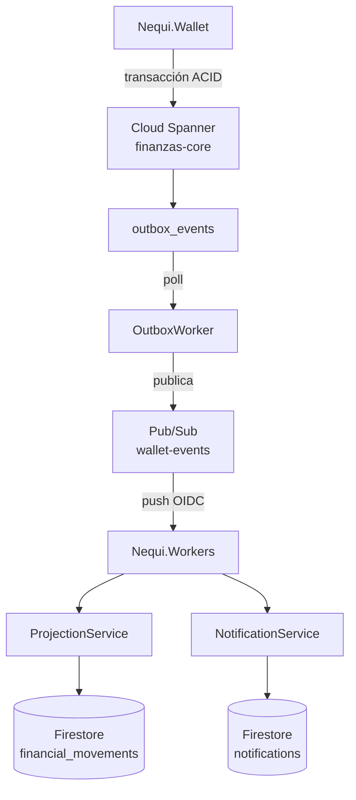

# Despliegue y Validación en Google Cloud Platform (GCP)

Guía de referencia para el despliegue y la validación de **NequiTrampa** en GCP,
según el estado **AS-IS verificado** en la integración actual.

---

## 1. Visión general de la arquitectura verificada

El flujo financiero completo es:

```
Nequi.Wallet (Cloud Run)
   │  transacción ACID en Spanner
   ▼
Cloud Spanner (finanzas-core)
   │  escribe dinero + ledger + outbox_events (misma transacción)
   ▼
outbox_events
   │  poll del OutboxWorker
   ▼
OutboxWorker (Nequi.Workers)
   │  publica evento de dominio
   ▼
Pub/Sub (wallet-events)
   │  push OIDC (pubsub-push-invoker)
   ▼
Nequi.Workers (/internal/pubsub/projection, /internal/pubsub/notifications)
   │  ProjectionService / NotificationService (idempotente por eventId)
   ▼
Firestore (fullstack-d3be5)
   financial_movements + notifications
```

El patrón **Transactional Outbox** garantiza que el evento de dominio se
persiste en la misma transacción de Spanner que mueve el dinero. La entrega es
*at-least-once* y los consumidores son idempotentes por `eventId`. Ante un
fallo de publicación, `SpannerOutboxStore` reintenta el evento mientras siga
pendiente (`pending_since IS NOT NULL`); agotado el máximo (`MaxAttempts=10`),
`pending_since` pasa a `NULL` y el evento deja de entrar en el índice de
pendientes, quedando a la espera de investigación e intervención.



---

## 2. Layout multi-proyecto

El despliegue está dividido en dos proyectos GCP para desacoplar el plano
transaccional bancario del plano documental de experiencia de usuario.

### Proyecto principal: `full-stack-2026`

| Recurso | Detalle |
|---|---|
| Cloud Run | `nequi-wallet`, `nequi-workers` (privados, solo IAM) |
| Cloud Spanner | Instancia `finanzas-mvp`, base `finanzas-core` |
| Pub/Sub | Topic `wallet-events`; DLQ `wallet-events-dlq` |
| Suscripciones push | `workers-projection` → `/internal/pubsub/projection`; `workers-notifications` → `/internal/pubsub/notifications` |
| Secret Manager | `nequi-spanner-database` |
| Artifact Registry | Repositorio Docker `servicios` |

### Proyecto Firestore: `fullstack-d3be5`

| Recurso | Detalle |
|---|---|
| Firestore | Base `(default)`, modo `FIRESTORE_NATIVE`, región `southamerica-west1` |
| Colecciones | `financial_movements`, `notifications` (colecciones verificadas) |

---

## 3. Secret Manager: `nequi-spanner-database`

El secreto `nequi-spanner-database` contiene el **identificador canónico del
recurso** de Spanner (no una cadena de conexión tradicional):

```
projects/full-stack-2026/instances/finanzas-mvp/databases/finanzas-core
```

En Cloud Run se inyecta como variable de entorno `Spanner__Database` mediante
`--set-secrets`. Es un identificador **canónico de recurso**, no una
credencial: el mismo valor aparece también en `infra/common.sh`
(`SPANNER_DATABASE`) y en la documentación del repositorio.

---

## 4. IAM y push OIDC de Pub/Sub

Las suscripciones push autentican mediante **OIDC de Pub/Sub**:

1. La subscription push usa como *push auth service account* la SA
   `pubsub-push-invoker@full-stack-2026.iam.gserviceaccount.com`.
2. La SA `pubsub-push-invoker` tiene el rol `roles/run.invoker` sobre el
   servicio Cloud Run `nequi-workers` (`deploy.sh`, función `subscribe`).
3. La solicitud push lleva un token OIDC con *audience* igual al URL del
   servicio.
4. Los endpoints `/internal/pubsub/*` están marcados `AllowAnonymous` en la
   aplicación: la protección real la ejerce **Cloud Run IAM** a nivel de
   invocación, no un JWT de usuario final.

En el entorno validado, la entrega push por OIDC requirió que el agente de
servicio de Pub/Sub (`service-{número}@gcp-sa-pubsub.iam.gserviceaccount.com`)
tuviera capacidad de generar tokens OIDC para la *push service account*, es
decir `roles/iam.serviceAccountTokenCreator` sobre `pubsub-push-invoker`.
`setup.sh` automatiza ese binding de forma idempotente; no requiere aplicación
manual.

Service Accounts relevantes **creadas/reutilizadas por `setup.sh`**:
`wallet-service`, `outbox-dispatcher` y `pubsub-push-invoker`.

`setup.sh` asigna los roles de proyecto correspondientes a `wallet-service` y
`outbox-dispatcher`, y `roles/datastore.user` a ambos en `FIRESTORE_PROJECT_ID`
(`fullstack-d3be5`), donde vive Firestore — no en `PROJECT_ID`. Para
`pubsub-push-invoker`, `deploy.sh` asigna `roles/run.invoker` sobre
`nequi-workers`, y `setup.sh` automatiza el `roles/iam.serviceAccountTokenCreator`
del agente de servicio de Pub/Sub.

---

## 5. Scripts de infraestructura

Flujo de despliegue **para reproducir el núcleo AS-IS validado** (Wallet +
Workers):

```bash
# 1. Prerrequisitos: instancia `finanzas-mvp`, base `finanzas-core` y esquema
#    (database/spanner/01_schema.sql) ya existentes. setup.sh habilita la API
#    de Spanner pero no crea instancia, base ni esquema.
bash infra/setup.sh

# 2. Desplegar y validar el núcleo (un despliegue a la vez):
AUTH_DEMO_HEADERS=true bash infra/deploy.sh wallet
AUTH_DEMO_HEADERS=true bash infra/deploy.sh workers

# 3. Prueba de humo post-despliegue (sintética)
bash infra/smoke-test.sh
```

> **`deploy.sh all`** dispara además el despliegue de `Nequi.Realtime`, cuyo
> despliegue/validación E2E **no** está verificado en la integración actual.

| Script | Rol |
|---|---|
| `infra/setup.sh` | APIs, Artifact Registry, SA, Pub/Sub + DLQ, Firestore, Secret Manager, métricas |
| `infra/deploy.sh` | Build con Cloud Build (`infra/cloudbuild.yaml`) y despliegue a Cloud Run |
| `infra/cloudbuild.yaml` | Definición del build: docker build con `_SERVICE` y `_IMAGE` |
| `infra/smoke-test.sh` | Verificación sintética post-despliegue |

Detalle en [infra/README.md](../infra/README.md).

---

## 6. ADC para desarrollo local

Para ejecutar los servicios y herramientas localmente contra GCP:

```bash
gcloud auth application-default login
```

Esto instala las credenciales de *Application Default Credentials* (ADC) que
la librería `Google.Cloud.*` usa para conectarse a Spanner, Pub/Sub y
Firestore. En modo local también puede usarse `Data__Backend=memory` sin
necesidad de credenciales.

---

## 7. Validaciones: dos flujos distintos

Es importante distinguir dos validaciones con alcances diferentes.

### A) Smoke sintético (`infra/smoke-test.sh`)

- Publica un `DomainEvent` **directamente** en el topic `wallet-events`
  (`gcloud pubsub topics publish`), sin pasar por Wallet ni Spanner.
- Verifica `nequi-workers`: health checks, `financial_movements`,
  `notifications`, acceso de roles y creación de reportes.
- **NO valida** el flujo `Wallet → Spanner → Outbox`: el evento se inyecta
  en Pub/Sub, no se produce a partir de una transacción financiera real.

### B) E2E real validado (integración GCP)

Flujo completo validado durante la integración en GCP:

```
Wallet → Spanner (transacción + outbox_events) → OutboxWorker → Pub/Sub →
push OIDC → Nequi.Workers → Firestore
```

- Se ejecutó contra el servicio desplegado con `Data__Backend=gcp` y
  Spanner autoritativo.
- Las proyecciones en Firestore se verificaron a partir de transacciones
  financieras reales (transferencias y recargas) y no de eventos inyectados.

Este alcance E2E cubre el pipeline de proyección y notificación; no se
extiende a módulos sin evidencia específica.

---

## 8. Suite Bruno: resultados verificados

La suite de pruebas HTTP (`tests/bruno/`) se ejecutó contra el servicio
desplegado en GCP obteniendo:

| Métrica | Resultado |
|---|---|
| Requests | **18/18 PASS** |
| Tests | **2/2 PASS** |
| Assertions | **34/34 PASS** |
| Exit code | **0** |

Para reproducir:

```bash
cd tests/bruno
bru.cmd run --env gcp
```

*(Asignando previamente el identity token en `serverlessToken` según
[tests/bruno/README.md](../tests/bruno/README.md)).*

---

## 9. Estado Nequi.Realtime

- **Implementado / configurado en infraestructura**: existe el proyecto
  `src/Nequi.Realtime`, y `common.sh`/`setup.sh`/`deploy.sh` incluyen
  configuración y una service account `realtime-service`.
- **No validado E2E**: no existe evidencia de una validación end-to-end con
  clientes, por lo que **no** se lo incluye entre los componentes ni las
  service accounts verificados del despliegue actual.
