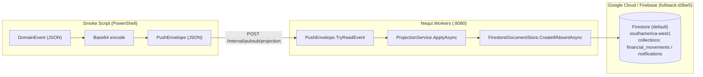

# Guía de Smoke Test: Proyección de Eventos hacia Cloud Firestore

Este documento describe la arquitectura, prerrequisitos, ejecución y validación del smoke test reproducible que comprueba la proyección de eventos de dominio hacia **Google Cloud Firestore**.

---

## 1. Declaración de Alcance y Principio de Autoridad Financiera

> [!IMPORTANT]
> **REGLA ABSOLUTA DE CONSISTENCIA FINANCIERA:**
> - **Cloud Spanner** es la única fuente de verdad autoritativa para saldos, transferencias, recargas y contabilidad (Ledger).
> - **Cloud Firestore** es exclusivamente un **Read Model / Proyección** optimizado para consultas de cliente móvil y experiencia de usuario.
> - Esta prueba utiliza un **DomainEvent sintético**. **NO** es una operación financiera real, **NO** afecta saldos contables en Spanner y **NO** representa dinero real.

### Distinción Crítica de Flujos

```
========================================================================================
1. SMOKE TEST SINTÉTICO (Aislamiento de la Proyección):
   DomainEvent sintético -> PushEnvelope -> POST /internal/pubsub/projection
                         -> ProjectionService -> FirestoreDocumentStore -> financial_movements

2. VALIDACIÓN REAL END-TO-END (Flujo Completo Verificado en GCP):
   Nequi.Wallet -> Cloud Spanner (Transacción Contable + outbox_events)
                -> Outbox Worker (Nequi.Workers)
                -> Cloud Pub/Sub (wallet-events)
                -> Push Subscription con autenticación OIDC
                -> Nequi.Workers (/internal/pubsub/projection y /internal/pubsub/notifications)
                -> Cloud Firestore (financial_movements y notifications)
========================================================================================
```

---

## 2. Arquitectura de Proyección



### Contrato del Envelope Pub/Sub Push

El endpoint `POST /internal/pubsub/projection` espera la estructura estándar que envía Google Cloud Pub/Sub en suscripciones de tipo Push:

```json
{
  "message": {
    "data": "<BASE64_UTF8_JSON_DOMAINEVENT>",
    "messageId": "smoke-msg-001"
  },
  "subscription": "projects/full-stack-2026/subscriptions/workers-projection"
}
```

Al decodificar `message.data` en Base64, se obtiene el JSON del `DomainEvent`:

```json
{
  "eventId": "smoke-firestore-001",
  "eventType": "RECHARGE_COMPLETED",
  "operationId": "smoke-operation-firestore",
  "clientId": "11111111-1111-4111-8111-111111111111",
  "occurredAt": "2026-09-22T19:00:00.000Z",
  "amountCents": 100,
  "currency": "COP",
  "description": "FIRESTORE_SMOKE_TEST",
  "balanceAfterCents": 40000100
}
```

---

## 3. Prerrequisitos

1. **Variables de Entorno para Workers:**
   - `Data__Backend = "gcp"`
   - `Gcp__ProjectId = "full-stack-2026"`
   - `Firestore__ProjectId = "fullstack-d3be5"`
   - Credenciales de GCP activas en el entorno local (vía `gcloud auth application-default login` o `GOOGLE_APPLICATION_CREDENTIALS`).
2. **Acceso a Firestore:**
   - Proyecto Firebase / GCP: `fullstack-d3be5`
   - Base de datos: `(default)`
   - Modo: `FIRESTORE_NATIVE`
   - Región: `southamerica-west1`
   - Colecciones existentes: `financial_movements` y `notifications`

---

## 4. Procedimiento de Ejecución

### Paso 1: Iniciar el servicio `Nequi.Workers`

En una terminal de PowerShell, iniciar Workers configurando el backend GCP y el proyecto Firestore:

```powershell
$env:Data__Backend = "gcp"
$env:Gcp__ProjectId = "full-stack-2026"
$env:Firestore__ProjectId = "fullstack-d3be5"
dotnet run --project src/Nequi.Workers
```

Workers iniciará escuchando en `http://localhost:8080`.

### Paso 2: Ejecutar el Smoke Test (Primera llamada - Creación)

Abrir otra terminal de PowerShell y ejecutar el script pasando un identificador explícito:

```powershell
.\scripts\firestore-projection-smoke.ps1 -WorkersBaseUrl "http://localhost:8080" -EventId "smoke-firestore-001"
```

**Resultado esperado:**
- HTTP `204 NoContent`.
- `ProjectionService` invoca `CreateIfAbsentAsync(financial_movements, "smoke-firestore-001", ...)`.
- Firestore crea el documento con ID `smoke-firestore-001`.

### Paso 3: Comprobar Idempotencia (Segunda llamada - Reutilización de EventId)

Ejecutar exactamente el mismo comando:

```powershell
.\scripts\firestore-projection-smoke.ps1 -WorkersBaseUrl "http://localhost:8080" -EventId "smoke-firestore-001"
```

**Resultado esperado:**
- HTTP `204 NoContent`.
- Firestore devuelve `Grpc.Core.StatusCode.AlreadyExists`, capturado por `FirestoreDocumentStore.CreateIfAbsentAsync`, retornando `false`.
- En los logs de Workers aparecerá:
  ```
  Projection skipped duplicate event smoke-firestore-001
  ```
- **NO** se crea ningún documento adicional ni se duplica información.

---

## 5. Verificación en Firebase Console

1. Ingrese a [Firebase Console](https://console.firebase.google.com/) o a Google Cloud Console.
2. Seleccione el proyecto `fullstack-d3be5`.
3. Navegue a **Firestore Database** -> Base `(default)`.
4. Ubique la colección **`financial_movements`**.
5. Busque el documento con ID exacto: `smoke-firestore-001`.

### Campos esperados en el documento:

| Campo | Tipo | Valor esperado |
| :--- | :--- | :--- |
| `eventId` | string | `"smoke-firestore-001"` |
| `operationId` | string | `"smoke-operation-firestore"` |
| `clientId` | string | `"11111111-1111-4111-8111-111111111111"` |
| `type` | string | `"RECHARGE_COMPLETED"` |
| `amountCents` | number (integer) | `100` |
| `currency` | string | `"COP"` |
| `counterpartyClientId` | null | `null` |
| `description` | string | `"FIRESTORE_SMOKE_TEST"` |
| `balanceAfterCents` | number (integer) | `40000100` |
| `occurredAt` | string (ISO-8601) | Timestamp UTC (ej. `"2026-09-22T19:00:00.0000000Z"`) |
| `syncStatus` | string | `"SYNCED"` |
| `status` | string | `"COMPLETED"` |

---

## 6. Limpieza Manual del Documento de Prueba

Para mantener el ambiente limpio:

1. En la consola de Firestore, en la colección `financial_movements`, localice únicamente el documento con ID `smoke-firestore-001` (o el generado para la prueba).
2. Haga clic en los tres puntos del documento y seleccione **Eliminar documento**.
3. **PRECAUCIÓN:** No elimine documentos productivos/reales existentes ni la colección `categories`.

---

## 7. Evidencia Académica Sugerida

Para documentar la validez del laboratorio:
1. **Captura 1:** Salida del script de PowerShell mostrando status code `204` y el `EventId` utilizado.
2. **Captura 2:** Registro en los logs de `Nequi.Workers` mostrando la recepción del push y el descarte por duplicado en la segunda llamada (`Projection skipped duplicate event`).
3. **Captura 3:** Firebase Console mostrando el documento creado en la colección `financial_movements` con sus respectivos campos.
